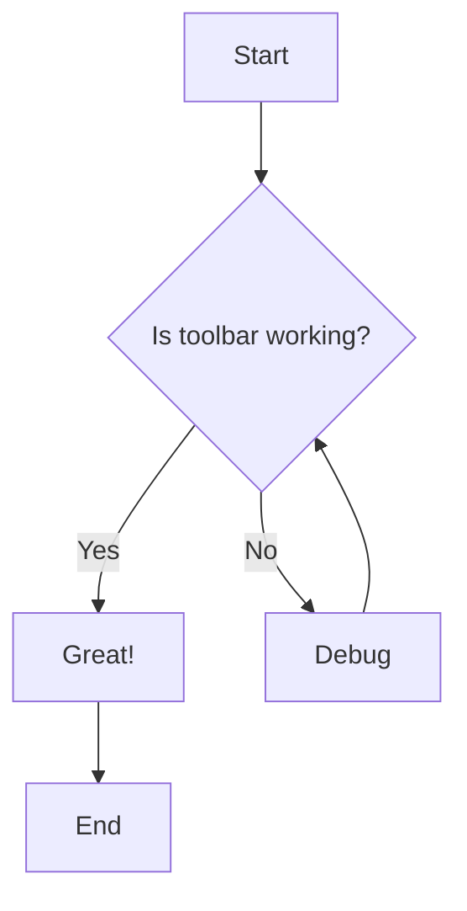

# Welcome to Observe!

This is a **sample markdown document** to test the new toolbar features.

## Text Formatting

You can use *italics*, **bold**, and ~~strikethrough~~ text.

**TEST**

## Lists

### Bullet List
- Item 1
- Item 2
- Item 3

### Numbered List
1. First item
2. Second item
3. Third item

### Task List
- [x] Completed task
- [ ] Pending task
- [ ] Another pending task

## Code

Here's some `inline code`.

```javascript
// Code block with syntax highlighting
function hello() {
    console.log("Hello from the toolbar!");
}
```

## Links and Images

[This is a link](https://example.com)

## Tables

| Feature | Status | Notes |
|---------|--------|-------|
| Bold | ✅ | Working |
| Italic | ✅ | Working |
| Tables | ✅ | Working |
| Toolbar | ✅ | Newly added! |

## Mermaid Diagram



---

Enjoy using the new markdown editor with toolbar! 